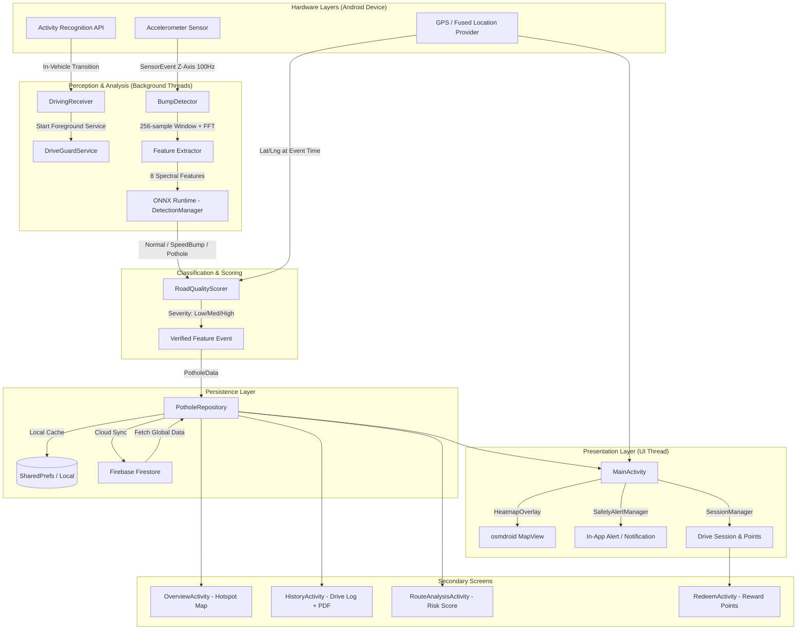

# RoadWise System Architecture Diagram

### Key Logic Paths:

1. **Detection Path:** Accelerometer → `BumpDetector` → FFT Features → ONNX Model → Severity Score
2. **Location Path:** GPS tags every verified event at the exact moment of detection
3. **Sync Path:** Events written locally first, then pushed to Firestore; fetch merges cloud + local
4. **Heatmap Path:** `PotholeRepository` data → `HeatmapOverlay` → rendered as radial glow clusters on osmdroid
5. **Background Path:** Activity Recognition detects vehicle → starts `DriveGuardService` → keeps sensing alive

### Why No Camera?

The current architecture is **sensor-only by design**. Camera-based detection was explored in early prototypes but removed because:
- Sensor + ONNX approach achieves comparable accuracy with **significantly lower battery drain**
- Works in any lighting condition (night, tunnels, rain)
- No camera permission required — better for user privacy
- On-device inference latency < 100ms using only accelerometer features
